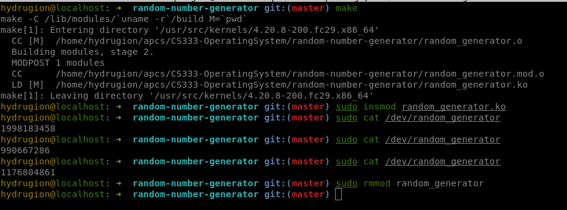
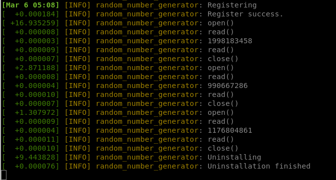

# Random number generator module

## Build

Build the kernel object module

    $ make
    $ modinfo random_generator.ko

To clean the build folder

    $ make clean

## Installation

Install the module

    $ sudo insmod random_generator.ko
    $ dmesg

## Usage

Read a random number from terminal

    $ sudo cat /dev/random_generator

## Uninstallation

Uninstall the module

    $ sudo rmmod random_generator
    $ dmesg

Check the installation status

    $ lsmod | grep "random_generator"

## Demo

Main terminal:

Logging:

